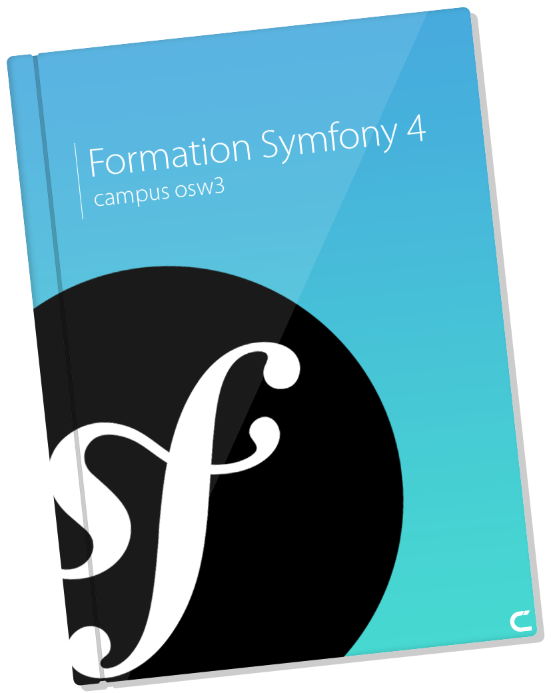

# Memo Symfony 4

---

Ce mémo Symfony 4 est destiné à vous guider dans le développement de vos applications avec le Framework Symfony 4. Symfony 3 n'est pas concerné par ce mémo.

---

* [Le gestionnaire **Composer**](composer.md)
* [L'architecture](architecture.md)
* [Créer un nouveau projet](creer-un-nouveau-projet.md)
* [Démarrer le serveur](demarrer-le-serveur.md)
* [Les dépendances essentielles](xxx.md)
* [Base de données avec Doctrine](xxx.md)
* [Créer une Entité](xxx.md)
* [Créer une Fixture](xxx.md)
* [Créer un Contrôleur](xxx.md)
* [Créer un Formulaire](xxx.md)
* [Routage (YAML)](xxx.md)
* [Créer un Bundle](xxx.md)
